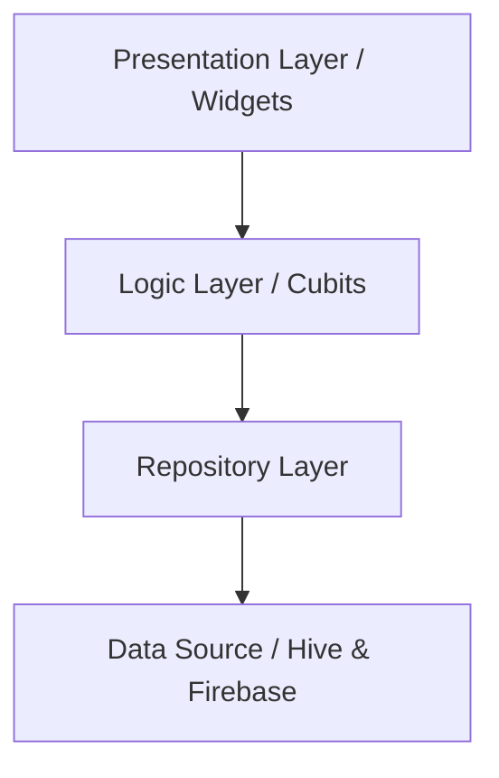

# Ella Lyaabdoon (إلا ليعبدون)

[](https://flutter.dev)
[](https://dart.dev)
[](https://firebase.google.com/)
[](https://opensource.org/licenses/MIT)

**Ella Lyaabdoon** is a smart, modern spiritual companion app designed to help Muslims build a consistent and meaningful relationship with Zekr (remembrance of Allah). Inspired by the profound concept of turning every moment into worship, the app organizes your day around prayer times, offering authentic, Hadith-backed rewards.

---

## ✨ Key Features

### 📅 Smart Spiritual Timeline
Your journey is organized by prayer times. The app dynamically highlights the most relevant Azkar for your current moment, ensuring you stay connected throughout the day.

### 📜 Authentic Rewards
Every Zekr is backed by authentic Hadiths. Know the exact merit and reward for every word you say.
> *"Shall I not tell you the best of your deeds... Remembering Allah."* — Prophet ﷺ

### 📊 Visual Progress Journey
Track your consistency with a beautiful calendar view. See your progress, visualize your streaks, and build lasting spiritual habits.

### 🏠 Interactive Home Widgets
Access your spiritual goals directly from your home screen. Our interactive widgets allow you to refresh rewards and check completed Zekr without even opening the app.

### 🎧 Multi-Reciter Audio Support
Start your day with the beautiful recitation of the Quran. Choose from various world-renowned reciters to play at app startup.

### 🌗 Premium UI/UX
- **Dark/Light Mode**: Full support for system themes with a curated, eye-pleasing green palette.
- **Multilingual**: Seamlessly switch between **Arabic** and **English**.
- **Onboarding**: A smooth introduction to the app's core philosophy.

---

## 🛠 Tech Stack

- **Framework**: [Flutter](https://flutter.dev) (v3.9.0+)
- **State Management**: [flutter_bloc](https://pub.dev/packages/flutter_bloc) (Cubit/Bloc)
- **Database**: [Hive](https://pub.dev/packages/hive) (Local storage) & [Firestore](https://firebase.google.com/docs/firestore)
- **Navigation**: [go_router](https://pub.dev/packages/go_router)
- **Dependency Injection**: [get_it](https://pub.dev/packages/get_it)
- **Push Notifications**: [Firebase Cloud Messaging](https://firebase.google.com/docs/cloud-messaging)
- **Prayer Times**: [adhan_dart](https://pub.dev/packages/adhan_dart)
- **Analytics & Crash Reporting**: Firebase Analytics, Crashlytics, and [Clarity](https://pub.dev/packages/clarity_flutter)
- **Localization**: [easy_localization](https://pub.dev/packages/easy_localization)
- **Over-the-Air Updates**: [Shorebird](https://shorebird.dev)

---

## 🏗 Architecture

The project follows a **Feature-First Clean Architecture** approach, ensuring scalability and maintainability.



- **Core**: Contains shared services, constants, and utilities (e.g., location service, database providers).
- **Features**: Modularized by functionality (Home, History, Settings, Intro). Each feature contains its own logic and presentation layers.
- **Dependency Injection**: Centrally managed via `get_it` for decoupling components.

---

## 📁 Project Structure

```text
lib/
├── core/               # Shared logic, services, and constants
│   ├── di/             # Dependency Injection setup
│   ├── services/       # Location, Prayer, and Widget services
│   └── constants/      # App theme and routes
├── features/           # Feature-based modules
│   ├── home/           # Main dashboard and timeline
│   ├── history/        # Progress tracking and calendar
│   ├── settings/       # User preferences and customization
│   └── intro/          # Onboarding experience
├── utils/              # Helper classes and extensions
├── app_router.dart     # Centralized routing configuration
└── main.dart           # App entry point and initialization
```

---

## 🚀 Getting Started

### Prerequisites
- Flutter SDK (Beta channel recommended as per `pubspec.yaml`)
- Android Studio / VS Code
- Firebase Project setup

### Installation
1.  **Clone the repository**:
    ```bash
    git clone https://github.com/your-username/ella_lyaabdoon.git
    ```
2.  **Install dependencies**:
    ```bash
    flutter pub get
    ```
3.  **Run code generation**:
    ```bash
    flutter pub run build_runner build --delete-conflicting-outputs
    ```
4.  **Launch the app**:
    ```bash
    flutter run
    ```

---

## 🙌 Contributors

Special thanks to everyone who contributed to making this app possible. You can find the list of contributors in the app's settings or under `assets/contributors/`.

---

## 📄 License

This project is licensed under the MIT License - see the [LICENSE](LICENSE) file for details.

---

*Made with ❤️ for the Ummah.*
