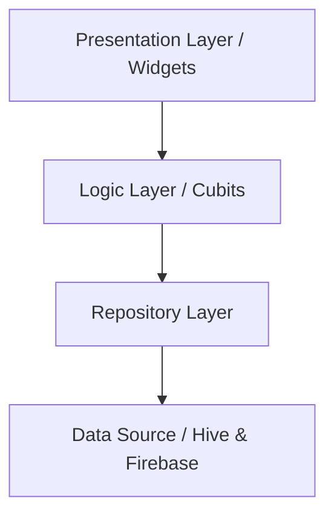

# Ella Lyaabdoon (إلا ليعبدون)

[](https://flutter.dev)
[](https://dart.dev)
[](https://firebase.google.com/)
[](https://opensource.org/licenses/MIT)

**Ella Lyaabdoon** (إلا ليعبدون) is a smart, modern spiritual companion app designed to help Muslims build a consistent and meaningful relationship with Zekr (remembrance of Allah). Inspired by the profound concept of turning every moment into worship, the app organizes your day around prayer times, offering authentic, Hadith-backed rewards.

> **Current Version**: 1.6.0+18

## 🏆 App Achievements

| Metric | Value |
|--------|-------|
| **Rating** | ⭐ 4.9/5 |
| **Reviews** | 240+ |
| **Downloads** | 10K+ |
| **Last Updated** | May 18, 2026 |
| **Content Rating** | Rated for 3+ |
| **Category** | Books & Reference |

## 📲 Download Now

<a href="https://play.google.com/store/apps/details?id=com.amrabdelhameed.ella_lyaabdoon">

</a>


<a href="https://play.google.com/store/apps/details?id=com.amrabdelhameed.ella_lyaabdoon">

</a>

## ✨ Key Features

### 📅 Smart Spiritual Timeline
Your journey is organized by prayer times. The app dynamically highlights the most relevant Azkar for your current moment, ensuring you stay connected throughout the day.

### 📜 Authentic Rewards
Every Zekr is backed by authentic Hadiths. Know the exact merit and reward for every word you say.
> *"Shall I not tell you the best of your deeds... Remembering Allah."* — Prophet ﷺ

### 📊 Visual Progress Journey
Track your consistency with beautiful charts and calendar views. See your progress, visualize your streaks, and build lasting spiritual habits.

### 🏠 Interactive Home Widgets
Access your spiritual goals directly from your home screen. Our interactive widgets allow you to refresh rewards and check completed Zekr without even opening the app. You can pin the specialized widget for quick access.

### 🔔 Smart Reminders & Notifications
Never miss your Azkar with customizable daily reminders. Manage your schedule directly from the app, with the ability to view and delete pending notifications at your convenience.

### 🕋 Fasting Reminders
Never forget your spiritual commitments with dedicated fasting reminders. Get notified to fast on Monday (reminder every Sunday) and Thursday (reminder every Wednesday) at 9 PM - fully customizable to your preference.

### 🔔 Notification System Features
- **Local Notifications**: Schedule one-time, daily, or specific time notifications
- **FCM (Firebase Cloud Messaging)**: Push notifications with image support
- **Smart Actions**: "Mark Done" button on Zikr notifications to complete directly from notification
- **Analytics Tracking**: Log notification opens and streak warning events
- **Background Handling**: Process notification taps even when app is closed
- **Scheduled Notifications**: View, count, and manage pending notifications
- **Topic Subscriptions**: Subscribe/unsubscribe from notification topics
- **Priority & Styling**: High priority with vibration, sound, and big text/picture styles

### 🎬 Alternative View Modes
- **Timeline View**: Traditional vertical scrollable list organized by prayer times
- **Reels View**: TikTok-style vertical swipe interface for a more engaging experience

### 📈 Advanced Statistics & Analytics
- Streak tracking with milestone celebrations
- Daily, weekly, monthly, and all-time statistics
- Interactive charts (7, 14, 30, 90 days)
- Activity heatmap visualization
- Achievement badges and milestones (7, 14, 30, 60, 100+ days)
- Streak saves system to preserve your progress

### 🕌 Prayer Time Calculation
- Multiple calculation methods (Egyptian, Karachi, ISNA, MWL, Umm Al-Qura, Dubai, Kuwait, Qatar, Singapore, Morocco, Moonsighting Committee, Turkiye, Tehran, North America)
- Madhab selection (Shafi'i/Hanafi)
- Automatic location-based calculation

### 🌍 Location Services
- Automatic location detection
- Manual location refresh
- City display and update

### 🔄 Data Management
- Export and import data for backup
- Local storage with Hive database

### 🌗 Premium UI/UX
- **Dark/Light Mode**: Full support for system themes with a curated, eye-pleasing green palette.
- **Multilingual**: Seamlessly switch between **Arabic** and **English**.
- **Onboarding**: A smooth introduction to the app's core philosophy.

### 📱 App Features
- In-app review prompts
- App update notifications (Shorebird/Upgrader)
- Screenshot and share Zikr cards
- Sadaqa Jariyah sharing options
- Community Zikr suggestions

### 💬 Support & Feedback
We value your feedback! Reach out to us directly via WhatsApp for suggestions or complaints to help us improve the experience for the Ummah.

---

## 📱 App Screens

1. **Intro Screen** - Onboarding with 4 pages explaining app philosophy
2. **Home Screen** - Main dashboard with prayer-time organized timeline
3. **Reels View** - Vertical TikTok-style Zikr browsing
4. **Statistics Screen** - Comprehensive progress tracking with charts and achievements
5. **Settings Screen** - Full customization options
6. **Notification Settings** - Manage reminders and notifications
7. **Location Permission** - Location setup for prayer times

---

## 🛠 Tech Stack

- **Framework**: [Flutter](https://flutter.dev) (v3.9.0+)
- **State Management**: [flutter_bloc](https://pub.dev/packages/flutter_bloc) (Cubit/Bloc)
- **Database**: [Hive](https://pub.dev/packages/hive) (Local storage) & [Firestore](https://firebase.google.com/docs/firestore)
- **Navigation**: [go_router](https://pub.dev/packages/go_router)
- **Dependency Injection**: [get_it](https://pub.dev/packages/get_it)
- **Push Notifications**: [Firebase Cloud Messaging](https://firebase.google.com/docs/cloud-messaging) & [flutter_local_notifications](https://pub.dev/packages/flutter_local_notifications)
- **Prayer Times**: [adhan_dart](https://pub.dev/packages/adhan_dart)
- **Location Services**: [geolocator](https://pub.dev/packages/geolocator) & [geocoding](https://pub.dev/packages/geocoding)
- **Charts**: [fl_chart](https://pub.dev/packages/fl_chart)
- **Home Widget**: [home_widget](https://pub.dev/packages/home_widget)
- **Analytics & Crash Reporting**: Firebase Analytics, Crashlytics, and [Clarity](https://pub.dev/packages/clarity_flutter)
- **Localization**: [easy_localization](https://pub.dev/packages/easy_localization)
- **Over-the-Air Updates**: [Shorebird](https://shorebird.dev) & [upgrader](https://pub.dev/packages/upgrader)
- **In-App Reviews**: [in_app_review](https://pub.dev/packages/in_app_review) & [rate_my_app](https://pub.dev/packages/rate_my_app)
- **UI Components**: [showcaseview](https://pub.dev/packages/showcaseview), [sticky_headers](https://pub.dev/packages/sticky_headers), [confetti](https://pub.dev/packages/confetti)
- **Calendar**: [syncfusion_flutter_calendar](https://pub.dev/packages/syncfusion_flutter_calendar)
- **Media**: [audioplayers](https://pub.dev/packages/audioplayers), [youtube_player_flutter](https://pub.dev/packages/youtube_player_flutter), [screenshot](https://pub.dev/packages/screenshot), [cached_network_image](https://pub.dev/packages/cached_network_image)
- **Sharing**: [share_plus](https://pub.dev/packages/share_plus), [url_launcher](https://pub.dev/packages/url_launcher)
- **Utilities**: [file_picker](https://pub.dev/packages/file_picker), [path_provider](https://pub.dev/packages/path_provider), [intl](https://pub.dev/packages/intl), [dio](https://pub.dev/packages/dio)

---

## 🏗 Architecture

The project follows a **Feature-First Clean Architecture** approach, ensuring scalability and maintainability.


```mermaid
graph TD
    UI[Presentation Layer / Widgets] --> Cubit[Logic Layer / Cubits]
    Cubit --> Repo[Repository Layer]
    Repo --> DataSource[Data Source / Hive & Firebase]
```

- **Core**: Contains shared services, constants, and utilities (e.g., location service, database providers).
- **Features**: Modularized by functionality (Home, History, Settings, Intro). Each feature contains its own logic and presentation layers.
- **Dependency Injection**: Centrally managed via `get_it` for decoupling components.

---

## 📁 Project Structure

```text
lib/
├── core/                           # Shared logic, services, and constants
│   ├── di/                         # Dependency Injection setup (get_it)
│   ├── services/                   # Core services (location, prayer, widget, streak, notifications)
│   ├── constants/                  # App theme, routes, and app lists (Azkar data)
│   ├── models/                     # Data models (timeline item, reward, azan period)
│   ├── shared_widgets/             # Reusable UI components
│   ├── utils/                      # Helper utilities (azan, ramadan, notifications)
│   └── services/dynamic_app_theme/ # Theme customization
├── features/                       # Feature-based modules
│   ├── home/                       # Main dashboard, timeline, and reels view
│   │   ├── presentation/           # UI screens and widgets
│   │   │   ├── screens/            # HomeScreen, ReelsViewScreen
│   │   │   └── widgets/             # Timeline, reward, streak widgets
│   │   └── logic/                  # Business logic (HomeCubit, TranslationCubit, QuranAudio)
│   ├── history/                    # Progress tracking (database and cubit)
│   ├── statistics/                 # Statistics screen with charts
│   ├── settings/                   # User preferences and customization
│   │   ├── presentation/           # Settings UI
│   │   └── logic/                   # Settings and location state management
│   └── intro/                      # Onboarding experience
├── utils/                          # Helper classes (notifications, dio, constants)
├── app_router.dart                 # Centralized routing configuration (go_router)
├── firebase_options.dart           # Firebase configuration
├── main.dart                       # App entry point and initialization
└── utils/constants/                # App colors
```

---

## 🎯 Key Functionality

### Azkar Categories
- **Morning Azkar** (أذكار الصباح)
- **Evening Azkar** (أذكار المساء)
- **General Zikr** for each prayer time (Fajr, Dhuhr, Asr, Maghrib, Isha)

### Milestone System
- Daily Zikr milestones: 10, 25, 50, 100, 250, 500, 1000
- Streak milestones: 7, 14, 30, 60, 100, 150, 200, 300, 365 days
- Period completion milestones: 25%, 50%, 75%, 100%

### Streak System
- Daily streak tracking with confetti celebrations
- Streak saves (shields) to preserve progress
- Next milestone progress tracking
- Active days and longest streak records

### Data Tracking
- Today's Zikr count
- Weekly, monthly, 3-month, 6-month, all-time totals
- Daily Zikr counts for charts (up to 90 days)
- Completion rate calculation

### Notification System Logic
- **Mark Done Action**: Zikr notifications include a "تم الذكر" (Mark Done) button that marks the specific zikr as completed directly from the notification
- **Smart Fallback**: If no specific reward_id is in payload, marks the first unchecked zikr from the timeline
- **Background Processing**: Uses dart:isolate for background notification handling
- **Image Support**: FCM notifications can include images (BigPictureStyleInformation)
- **Analytics Integration**: Tracks notification open events with Firebase Analytics
- **Error Isolation**: Streak and widget updates are isolated so failures don't break zikr marking
- **FCM Topics**: Supports topic-based push notifications (subscribe/unsubscribe)

---

## 🚀 Getting Started

### Prerequisites
- Flutter SDK (Beta channel recommended as per `pubspec.yaml`)
- Android Studio / VS Code
- Firebase Project setup

### Installation
1.  **Clone the repository**:
    ```bash
    git clone https://github.com/amrabdelhameeed/ella_lyaabdoon.git
    ```
2.  **Install dependencies**:
    ```bash
    flutter pub get
    ```
3.  **Run code generation**:
    ```bash
    flutter pub run build_runner build --delete-conflicting-outputs
    ```
4.  **Launch the app**:
    ```bash
    flutter run
    ```

---

## 🙌 Contributors

Special thanks to everyone who contributed to making this app possible. You can find the list of contributors in the app's settings or under `assets/contributors/`.

---

## 📄 License

This project is licensed under the MIT License - see the [LICENSE](LICENSE) file for details.

---

*Made with ❤️ for the Ummah.*
